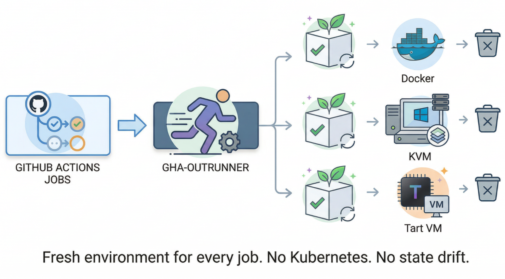

# gha-outrunner

Ephemeral GitHub Actions runners, no Kubernetes required.



outrunner provisions fresh Docker containers or VMs for each GitHub Actions job, then destroys them when the job completes. It uses GitHub's [scaleset API](https://github.com/actions/scaleset) to register as an autoscaling runner group.

**Why?** GitHub's [Actions Runner Controller (ARC)](https://github.com/actions/actions-runner-controller) requires Kubernetes. If you're running on bare metal or a simple VPS, you shouldn't need a cluster just to get ephemeral runners. outrunner gives you the same isolation guarantees with Docker, libvirt, or Tart.

## Provisioners

| Provisioner | Host OS | Runner OS | How it works |
|-------------|---------|-----------|--------------|
| Docker | Linux, macOS | Linux | Container per job. Fastest startup. |
| libvirt | Linux | Windows, Linux | KVM VM from qcow2 golden image with CoW overlays. QEMU Guest Agent for command execution. |
| Tart | macOS (Apple Silicon) | macOS, Linux (ARM64) | VM clone per job. Tart guest agent for command execution. |

## Quick Start

Build and run:

```bash
go build -o outrunner ./cmd/outrunner

./outrunner \
  --url https://github.com/your/repo \
  --token ghp_xxx \
  --config outrunner.yml \
  --max-runners 2
```

See the [tutorials](#tutorials) for step-by-step setup guides for each backend.

## Documentation

### Tutorials

Step-by-step guides to get your first runner working.

- [Docker runner on Linux](docs/tutorial/docker-linux.md)
- [Docker runner on macOS](docs/tutorial/docker-macos.md)
- [Tart Linux runner on macOS](docs/tutorial/tart-linux-runner.md) (ARM64)
- [Tart macOS runner on macOS](docs/tutorial/tart-macos-runner.md)
- [Windows VM runner on Linux](docs/tutorial/libvirt-windows.md) (libvirt/KVM)

### How-to Guides

Solutions for specific tasks.

- [Run multiple backends together](docs/howto/mixed-backends.md)
- [Deploy as a systemd service](docs/howto/systemd-service.md) (Linux)
- [Deploy as a launchd service](docs/howto/launchd-service.md) (macOS)
- [Build a custom Docker runner image](docs/howto/custom-docker-image.md)
- [Build a custom Windows VM image](docs/howto/custom-windows-image.md)
- [Build a custom Tart macOS image](docs/howto/custom-tart-macos-image.md)
- [Build a custom Tart Linux image](docs/howto/custom-tart-linux-image.md)
- [Set up for an organization](docs/howto/organization-setup.md)
- [Update runner images without downtime](docs/howto/update-runner-images.md)

### Reference

Technical specifications.

- [CLI reference](docs/reference/cli.md)
- [Configuration reference](docs/reference/configuration.md)
- [Provisioner reference](docs/reference/provisioners.md)
- [Runner image requirements](docs/reference/image-requirements.md)

### Explanation

Background and design decisions.

- [Architecture](docs/explanation/architecture.md)
- [Why outrunner](docs/explanation/why-outrunner.md)
- [Security model](docs/explanation/security.md)
- [How label matching works](docs/explanation/label-matching.md)

## License

MIT
